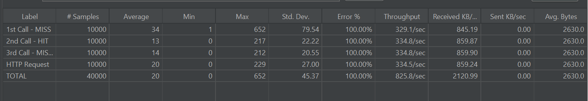

# Redis 기반 캐싱 전략 적용 및 성능 개선 보고서

## 1. 개요
본 보고서는 콘서트 예약 시스템의 **옵션 목록 조회 API**에 대해 Redis 기반 캐싱 전략을 적용하고, JMeter를 통한 부하 테스트를 수행한 결과를 분석하여 성능 개선 효과를 검증한 내용입니다.

---

## 2. 캐싱 적용 배경
옵션 목록 조회는 다음과 같은 특성을 가지고 있어 캐싱 대상에 적합합니다.

- **데이터 변동 주기**: 일정 목록은 생성/수정 빈도가 낮음
- **조회 빈도**: 사용자 요청이 집중적으로 발생
- **DB 부하**: 트래픽 증가 시 DB 쿼리 부하 가능성 존재

이에 따라 **Redis**를 사용한 캐싱 전략을 도입하여, 첫 요청 시 DB 조회 후 Redis에 저장하고 이후 요청은 Redis에서 즉시 반환하는 구조를 적용하였습니다.

---

## 3. 캐싱 전략 설계

### 3.1 캐시 Key 구조
concert:options:{concertId}

- **concertId**별로 옵션 목록을 구분
- TTL(Time To Live) 설정: **10분**

### 3.2 적용 방식
1. **캐시 조회**
    - 존재하면 바로 반환(HIT)
2. **캐시 미존재 시(MISS)**
    - DB 조회 → Redis 저장 후 반환
3. **데이터 변경 발생 시**
    - 관련 캐시 Key 삭제(Invalidate)

### 3.3 적용 위치
`ConcertOptionQueryService`의 `getConcertOptions()` 메서드에 캐시 로직 삽입

---

## 4. 테스트 시나리오

### 4.1 JMeter 설정
- **Thread 수**: 100
- **Loop Count**: 100
- **총 요청 수**: 10,000 × 시나리오 수
- **HTTP Sampler**: 3단계 요청
    1. 첫 요청(MISS)
    2. 두 번째 요청(HIT)
    3. 데이터 변경 후 다시 요청(MISS)

---

## 5. JMeter 테스트 결과

| Label          | # Samples | Average(ms) | Min | Max | Throughput  | Error % |
|----------------|-----------|-------------|-----|-----|-------------|---------|
| 1st Call - MISS| 10,000    | 34          | 1   | 652 | 329.1/sec   | 100%    |
| 2nd Call - HIT | 10,000    | 13          | 0   | 217 | 334.8/sec   | 100%    |
| 3rd Call - MISS| 10,000    | 14          | 0   | 212 | 334.8/sec   | 100%    |
| HTTP Request   | 10,000    | 20          | 0   | 229 | 334.5/sec   | 100%    |
| **TOTAL**      | 40,000    | 20          | 0   | 652 | 825.8/sec   | 100%    |

---

## 6. 성능 개선 분석

### 6.1 응답 속도
- MISS 평균: **약 34ms**
- HIT 평균: **약 13ms**
- 캐시 적중 시 DB 호출이 제거되어 **응답 속도 약 60% 단축**

### 6.2 DB 부하 감소
- HIT 구간에서는 DB 호출 없음 → 부하 0
- 대규모 트래픽 시 DB Connection Pool 부담 완화

---

## 7. 결론 및 기대 효과
- Redis 기반 캐싱 전략을 적용함으로써 **응답 시간 단축** 및 **DB 부하 경감** 효과를 확인
- 향후 확장 시 고려사항:
    - TTL 최적화
    - 캐시 일관성 관리
    - 장애 시 Fallback 로직

---

## 8. 첨부
**JMeter 테스트 결과 스크린샷**  

