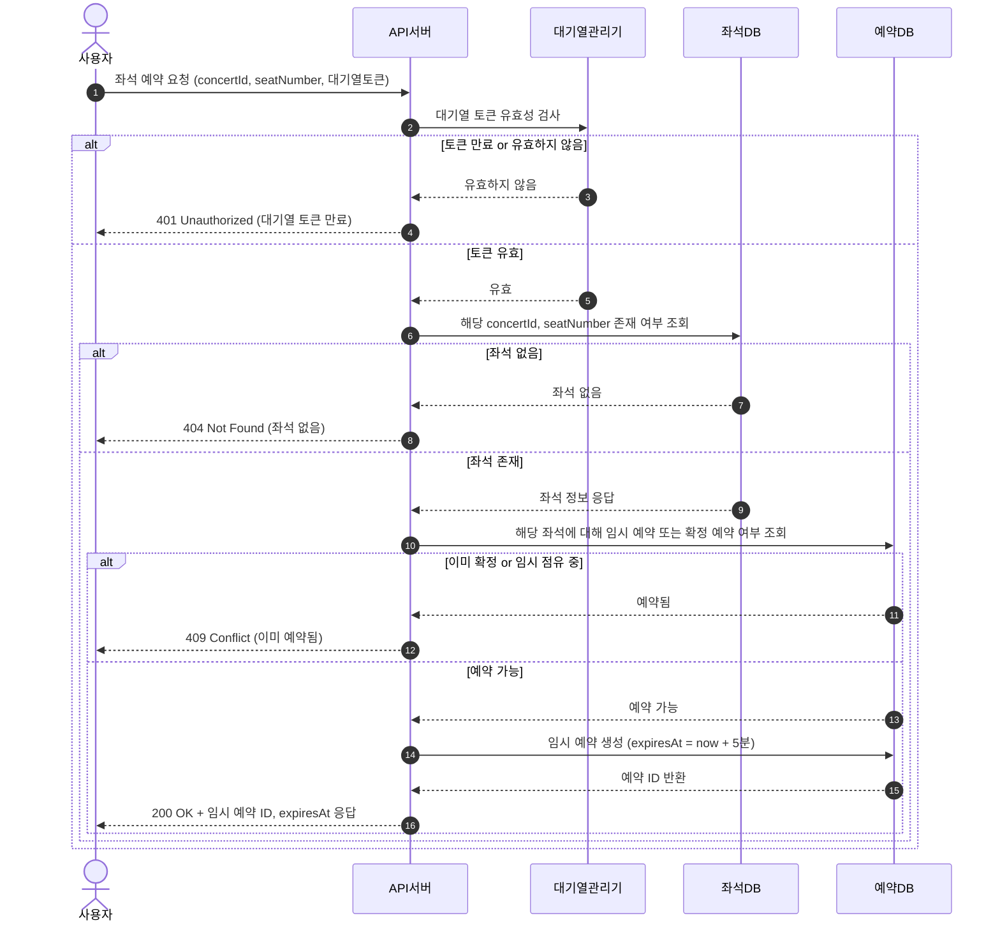

```mermaid
sequenceDiagram
    autonumber
    actor 사용자
    participant API서버
    participant 대기열관리기
    participant 좌석DB
    participant 예약DB

    사용자 ->> API서버: 좌석 예약 요청 (concertId, seatNumber, 대기열토큰)

    API서버 ->> 대기열관리기: 대기열 토큰 유효성 검사
    alt 토큰 만료 or 유효하지 않음
        대기열관리기 -->> API서버: 유효하지 않음
        API서버 -->> 사용자: 401 Unauthorized (대기열 토큰 만료)
    else 토큰 유효
        대기열관리기 -->> API서버: 유효

        API서버 ->> 좌석DB: 해당 concertId, seatNumber 존재 여부 조회
        alt 좌석 없음
            좌석DB -->> API서버: 좌석 없음
            API서버 -->> 사용자: 404 Not Found (좌석 없음)
        else 좌석 존재
            좌석DB -->> API서버: 좌석 정보 응답

            API서버 ->> 예약DB: 해당 좌석에 대해 임시 예약 또는 확정 예약 여부 조회

            alt 이미 확정 or 임시 점유 중
                예약DB -->> API서버: 예약됨
                API서버 -->> 사용자: 409 Conflict (이미 예약됨)
            else 예약 가능
                예약DB -->> API서버: 예약 가능

                API서버 ->> 예약DB: 임시 예약 생성 (expiresAt = now + 5분)
                예약DB -->> API서버: 예약 ID 반환
                API서버 -->> 사용자: 200 OK + 임시 예약 ID, expiresAt 응답
            end
        end
    end


```