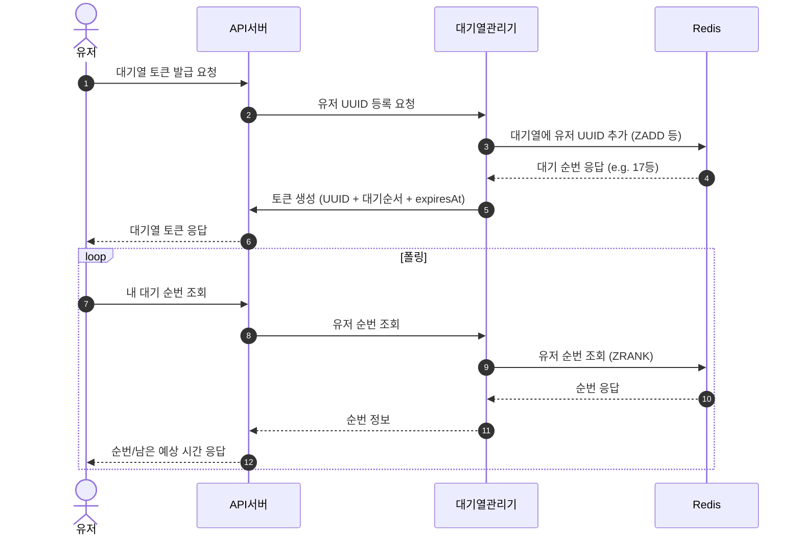

```mermaid
sequenceDiagram
    autonumber
    actor 유저
    participant API서버
    participant 대기열관리기
    participant Redis

    유저 ->> API서버: 대기열 토큰 발급 요청

    API서버 ->> 대기열관리기: 유저 UUID 등록 요청

    대기열관리기 ->> Redis: 대기열에 유저 UUID 추가 (ZADD 등)
    Redis -->> 대기열관리기: 대기 순번 응답 (e.g. 17등)

    대기열관리기 ->> API서버: 토큰 생성 (UUID + 대기순서 + expiresAt)

    API서버 -->> 유저: 대기열 토큰 응답

    loop 폴링
        유저 ->> API서버: 내 대기 순번 조회
        API서버 ->> 대기열관리기: 유저 순번 조회
        대기열관리기 ->> Redis: 유저 순번 조회 (ZRANK)
        Redis -->> 대기열관리기: 순번 응답
        대기열관리기 -->> API서버: 순번 정보
        API서버 -->> 유저: 순번/남은 예상 시간 응답
    end

```