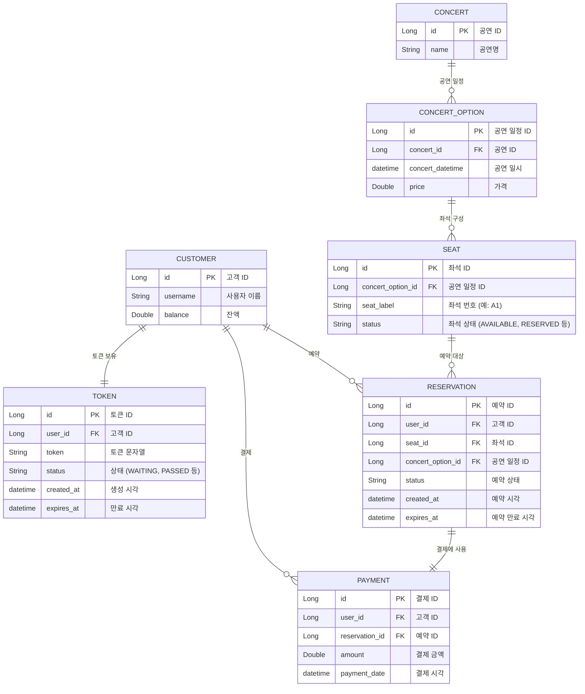

```mermaid
erDiagram
    CUSTOMER ||--|| TOKEN : "토큰 보유"
    CUSTOMER ||--o{ RESERVATION : "예약"
    CUSTOMER ||--o{ PAYMENT : "결제"
    CONCERT ||--o{ CONCERT_OPTION : "공연 일정"
    CONCERT_OPTION ||--o{ SEAT : "좌석 구성"
    SEAT ||--o{ RESERVATION : "예약 대상"
    RESERVATION ||--|| PAYMENT : "결제에 사용"

    CUSTOMER {
        Long id PK "고객 ID"
        String username "사용자 이름"
        Double balance "잔액"
    }

    TOKEN {
        Long id PK "토큰 ID"
        Long user_id FK "고객 ID"
        String token "토큰 문자열"
        String status "상태 (WAITING, PASSED 등)"
        datetime created_at "생성 시각"
        datetime expires_at "만료 시각"
    }

    CONCERT {
        Long id PK "공연 ID"
        String name "공연명"
    }

    CONCERT_OPTION {
        Long id PK "공연 일정 ID"
        Long concert_id FK "공연 ID"
        datetime concert_datetime "공연 일시"
        Double price "가격"
    }

    SEAT {
        Long id PK "좌석 ID"
        Long concert_option_id FK "공연 일정 ID"
        String seat_label "좌석 번호 (예: A1)"
        String status "좌석 상태 (AVAILABLE, RESERVED 등)"
    }

    RESERVATION {
        Long id PK "예약 ID"
        Long user_id FK "고객 ID"
        Long seat_id FK "좌석 ID"
        Long concert_option_id FK "공연 일정 ID"
        String status "예약 상태"
        datetime created_at "예약 시각"
        datetime expires_at "예약 만료 시각"
    }

    PAYMENT {
        Long id PK "결제 ID"
        Long user_id FK "고객 ID"
        Long reservation_id FK "예약 ID"
        Double amount "결제 금액"
        datetime payment_date "결제 시각"
    }

```