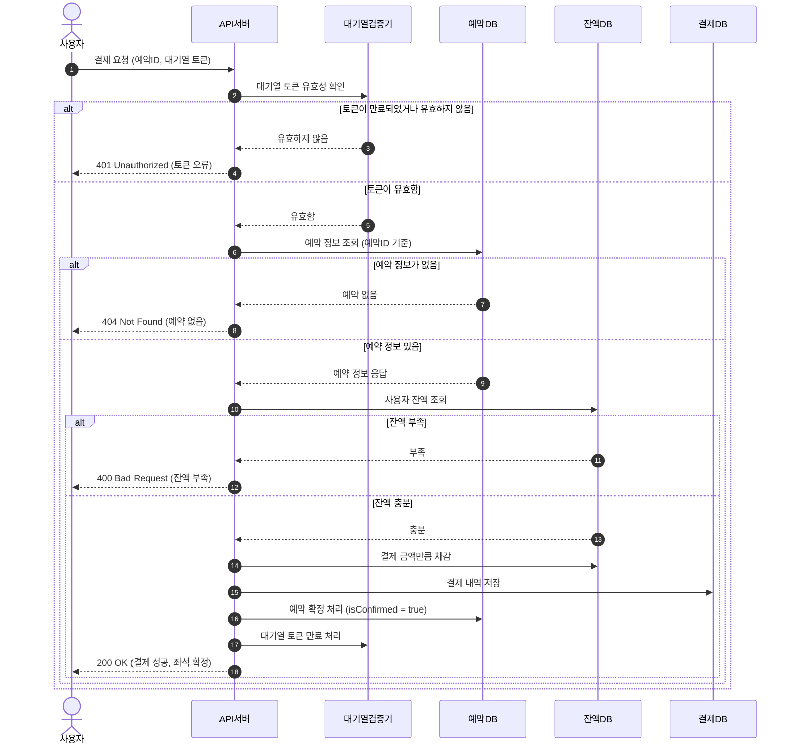

```mermaid
sequenceDiagram
    autonumber
    actor 사용자
    participant API서버
    participant 대기열검증기
    participant 예약DB
    participant 잔액DB
    participant 결제DB

    사용자 ->> API서버: 결제 요청 (예약ID, 대기열 토큰)

    API서버 ->> 대기열검증기: 대기열 토큰 유효성 확인
    alt 토큰이 만료되었거나 유효하지 않음
        대기열검증기 -->> API서버: 유효하지 않음
        API서버 -->> 사용자: 401 Unauthorized (토큰 오류)
    else 토큰이 유효함
        대기열검증기 -->> API서버: 유효함
        

        API서버 ->> 예약DB: 예약 정보 조회 (예약ID 기준)
        alt 예약 정보가 없음
            예약DB -->> API서버: 예약 없음
            API서버 -->> 사용자: 404 Not Found (예약 없음)
        else 예약 정보 있음
            예약DB -->> API서버: 예약 정보 응답

            API서버 ->> 잔액DB: 사용자 잔액 조회
            alt 잔액 부족
                잔액DB -->> API서버: 부족
                API서버 -->> 사용자: 400 Bad Request (잔액 부족)
            else 잔액 충분
                잔액DB -->> API서버: 충분

                API서버 ->> 잔액DB: 결제 금액만큼 차감
                API서버 ->> 결제DB: 결제 내역 저장
                API서버 ->> 예약DB: 예약 확정 처리 (isConfirmed = true)
                API서버 ->> 대기열검증기: 대기열 토큰 만료 처리

                API서버 -->> 사용자: 200 OK (결제 성공, 좌석 확정)
            end
        end
    end


```