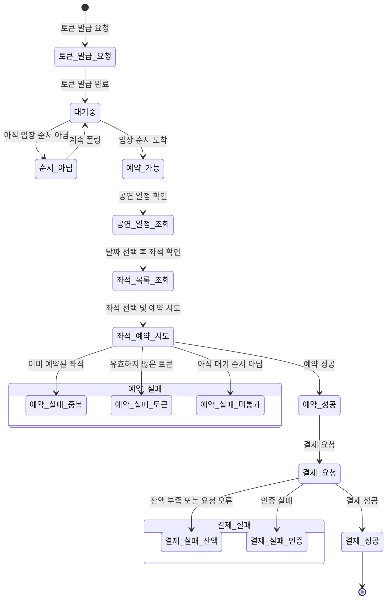

```mermaid
stateDiagram-v2
    [*] --> 토큰_발급_요청 : 토큰 발급 요청
    토큰_발급_요청 --> 대기중 : 토큰 발급 완료
    대기중 --> 순서_아님 : 아직 입장 순서 아님
    순서_아님 --> 대기중 : 계속 폴링

    대기중 --> 예약_가능 : 입장 순서 도착

    예약_가능 --> 공연_일정_조회 : 공연 일정 확인
    공연_일정_조회 --> 좌석_목록_조회 : 날짜 선택 후 좌석 확인

    좌석_목록_조회 --> 좌석_예약_시도 : 좌석 선택 및 예약 시도

    좌석_예약_시도 --> 예약_성공 : 예약 성공
    좌석_예약_시도 --> 예약_실패_중복 : 이미 예약된 좌석
    좌석_예약_시도 --> 예약_실패_토큰 : 유효하지 않은 토큰
    좌석_예약_시도 --> 예약_실패_미통과 : 아직 대기 순서 아님

    예약_성공 --> 결제_요청 : 결제 요청
    결제_요청 --> 결제_성공 : 결제 성공
    결제_요청 --> 결제_실패_잔액 : 잔액 부족 또는 요청 오류
    결제_요청 --> 결제_실패_인증 : 인증 실패

    state 예약_실패 {
        예약_실패_중복
        예약_실패_토큰
        예약_실패_미통과
    }

    state 결제_실패 {
        결제_실패_잔액
        결제_실패_인증
    }

    결제_성공 --> [*]


```